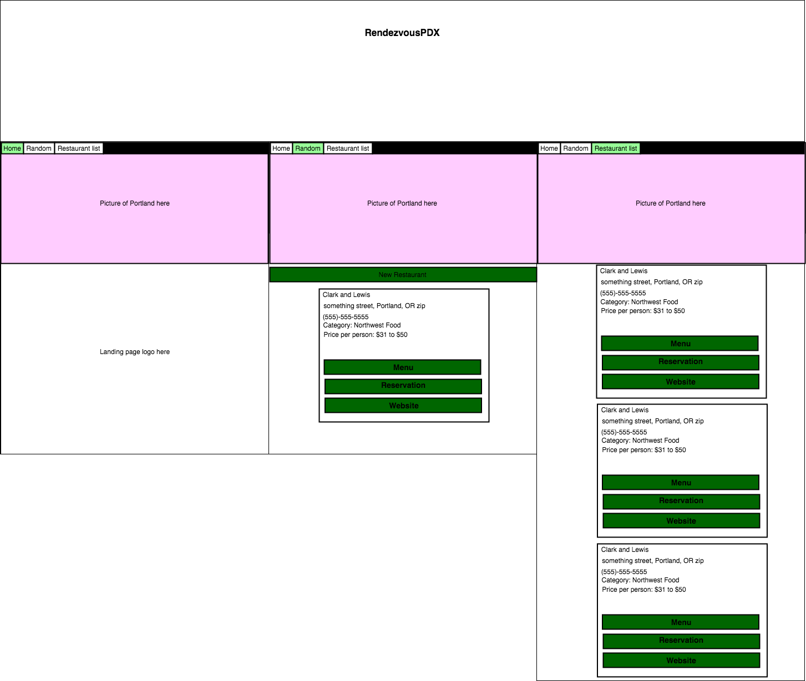

## Project created on 7/24/20

## Capstone Project

# Rendezvous in PDX

#### By **Tyler Bowerman**

## Description

This application is a tool to help couples in PDX deal with datenigt quandries.

## Specifications

|   Behavior Description|        Output Ex.      |
|------------------------|-----------------------|
|1.click/push 'New restaurant' button. | returns a random restaurant.|
|2. click/push 'Restaurants' tab on nav bar.|Returns a list of all restaurants in Database.|
|4. click/push 'Menu' button on restaurant details.| Opens a new tab for the restaurants menu.|
|5. click/push 'Reservation' button on restaurant details.| Opens a new tab for the restaurants Open Table page where users can make a reservation.|
|6. click/push 'Website' button on restaurant details| Opens a new tab for the restaurants homepage.|

## Componet Diagram

## Setup/Installation Requirements
1* _Clone repository from Github: https://github.com/bowty14/Rendezvous.git_
* _In the Terminal type : `$ git clone` [https://github.com/bowty14/Rendezvous.git]_
* _Navigate to folder by typing  `$ cd Rendezvous` in terminal._
* _Open the file up in the code editior of choice_
* _You will need to install all dependencies. Do this by running `npm run install`_

* _To view project in browser type in terminal, `npm run start`._
* _Navigate to localhost:3000_
* _[View the hosted site](https://rendezvouspdx.netlify.app/) as mentioned below in known bugs this app will not work on a mobile view. Please view on a desktop and do not reload the random or restaurant pages, it will crash._
## Known Bugs
Hosted site will not work on mobile for some unknown reason since it works fine locally. Viewing the hosted site on a desktop the app works great as long as you don't hit refresh on the /random or restaurantList tabs.

## Capstone proposal 

Name of Student: Tyler Bowerman

Name of Project: Rendezvous in PDX

Project's Purpose or Goal: (What will it do for users?) help to make date nights easier for couples in PDX. App will output a random restaurant when button clicked. Will be able to view all restaurants in the database

List the absolute minimum features the project requires to meet this purpose or goal:

Have a landing page that has a button to produce a random restaurant 
second page that will list out all restaurants in database
What tools, frameworks, libraries, APIs, modules and/or other resources (whatever is specific to your track, and your language) will you use to create this MVP? List them all here. Be specific.

Custom built Rails api for restaurant database.
Ruby on Rails, decided to do Reactjs front-end instead of Ruby.
If you finish developing the minimum viable product (MVP) with time to spare, what will you work on next? Describe these features here: Be specific.

Incorcoporate the use of React.js
Add google maps for each restaurant listing
Add links for a reservation to each listing
Search function to find restaurants in database by category, price, and name
What additional tools, frameworks, libraries, APIs, or other resources will these additional features require?

Google maps API
Add links to database for reservations 
Is there anything else you'd like your instructor to know? 

I will be building out two projects, a custom Rails API for all the restaurants to be used in another app that will display the restaurants and hopefully google maps.

## Support and contact details
_Have a bug or an issue with this application? [Open a new issue](https://github.com/bowty14/Rendezvous/issues) here on GitHub.com_

## Technologies Used
* >_Reactjs_
* >_JavaScript(ES6)_
* >_CSS_
* >_Git_
* >_GitHub_
* >_Api's_
* >_This project uses a custom built API that can be accessed at this address `https://salty-fjord-35244.herokuapp.com/restaurants`_
### License

*This software is licensed under the MIT license* 

Copyright (c) 2020 **Tyler Bowerman**
